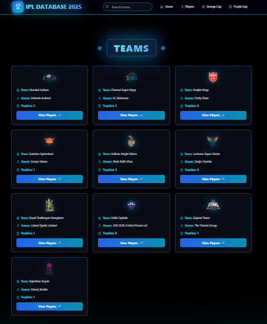
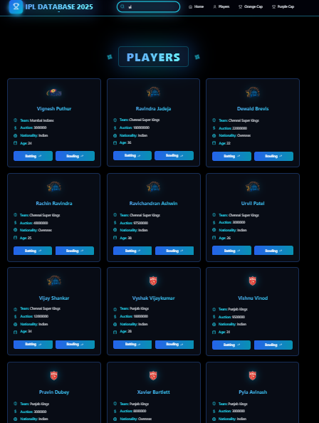
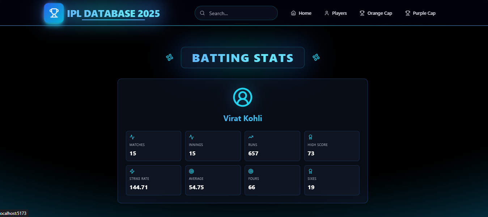
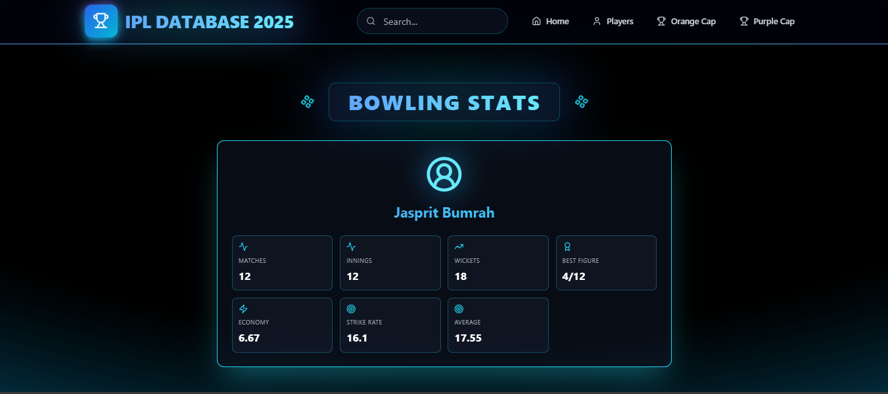
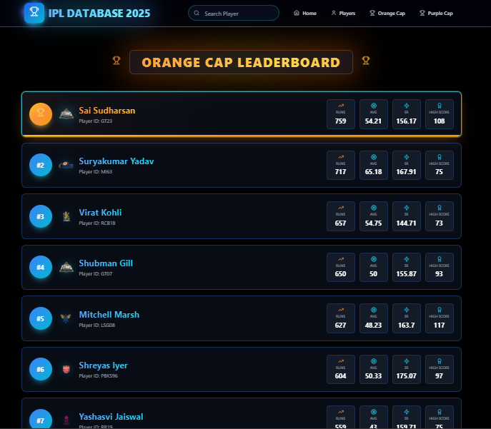
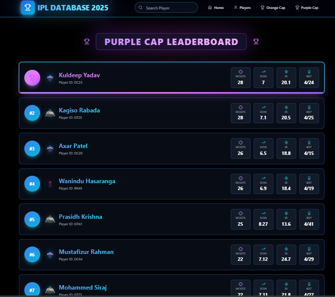

# Criclytics — IPL 2025 Analytics Dashboard

A full-stack web app to explore IPL 2025 data — teams, players, and performance stats — with leaderboards for top batters and bowlers.

---

## Tech Stack


---

## How It Works

The app follows a simple drill-down structure:

```
Teams → Team Players → Player → Batting / Bowling Stats

All Players → Player → Batting / Bowling Stats

Leaderboards → Orange Cap (Top Runs) / Purple Cap (Top Wickets)
```

---

## Features

**Teams Page**
Browse all IPL teams in a grid. Search by name. Click a team to see its players.

**All Players Page**
View every player across all teams — with their team name, auction price, nationality, and age. Navigate to individual batting or bowling stats.

**Team Players Page**
Shows only the players belonging to a selected team. Includes search within the team.

**Batting Stats**
Displays matches, innings, runs, highest score, strike rate, average, fours, and sixes for a player.

**Bowling Stats**
Displays matches, innings, wickets, best figures, economy, strike rate, and average for a player.

**Orange Cap Leaderboard**
Lists all batters ranked by runs scored (highest first). Highlights the top player. Searchable.

**Purple Cap Leaderboard**
Lists all bowlers ranked by wickets taken (highest first). Highlights the top bowler. Searchable.

**Navbar**
Shared across all pages. Handles navigation via React Router, search input connected to each page, Enter-key submission, and a mobile hamburger menu.

---

## API Endpoints

| Endpoint | Description |
|---|---|
| `GET /` | All teams |
| `GET /players` | All players with team info (SQL JOIN) |
| `GET /:TeamID/players` | Players for a specific team |
| `GET /players/:PlayerID` | Individual player details |
| `GET /batting_stats` | All batting stats, sorted by runs (Orange Cap) |
| `GET /bowling_stats` | All bowling stats, sorted by wickets (Purple Cap) |
| `GET /players/:PlayerID/batting_stats` | Batting stats for one player |
| `GET /players/:PlayerID/bowling_stats` | Bowling stats for one player |

---

## Getting Started

```bash
# Clone the repo
git clone https://github.com/your-username/criclytics.git
cd criclytics

# Set up the backend
cd backend
npm install
cp .env.example .env    # Add your DB credentials
node index.js

# Set up the frontend
cd ../frontend
npm install
npm run dev
```

**.env file**
```
DB_HOST=localhost
DB_USER=root
DB_PASSWORD=yourpassword
DB_NAME=criclytics
PORT=5000
```

---

## Screenshots

>
**NavBar Component:**


---
**Home Page: (With all team names and info)**


---
**Total Players Page: (All players irrespective of teams with working of search bar)**


---
**Batting Stats of each specific player:**


---
**Bowling stats of each specific player**:


---
**Orange Cap Leaderboard preview**:


---
**Purple Cap Leaderboard preview**:


---


## What I Built

- Connected a React frontend to a Node + MySQL backend using REST APIs
- Used SQL `JOIN` queries to combine player and team data
- Implemented ranking using `ORDER BY` in SQL (no client-side sorting)
- Built multi-level navigation with React Router and dynamic URL params
- Created reusable components (Navbar, Player Cards) used across multiple pages

---

## Planned Improvements

- [ ] Add charts with Recharts or Chart.js
- [ ] Add caching to speed up leaderboard queries
- [ ] Add user authentication
- [ ] Deploy frontend (Vercel) and backend (Railway)

---

*React · Node.js · Express · MySQL · Tailwind CSS*
